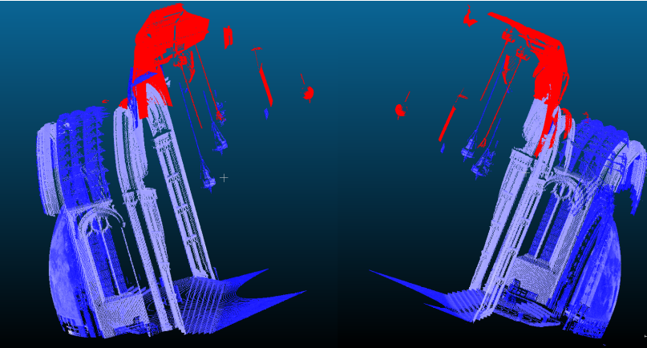
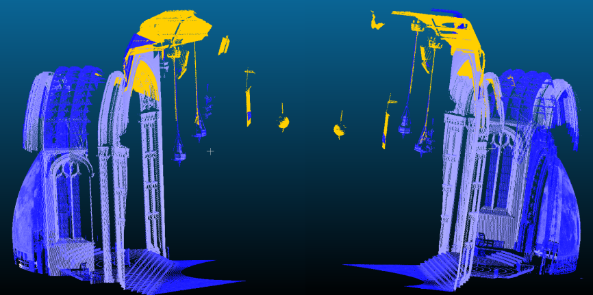
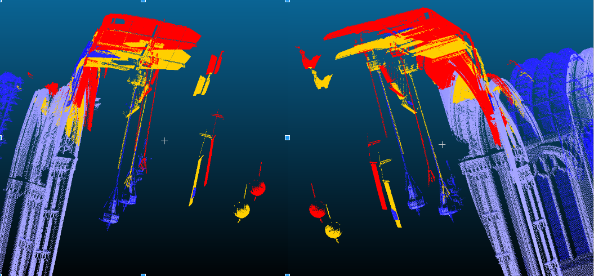

# Project 2 - Point Cloud Registration
3D Photography

CUNY Graduate Center

Professor Stamos

# Task
Given two range images R1 and R2, compute the rotation and translation that would register the two point clouds. 

# Input
 Range image R in a .ptx format. The first 10 lines are the header lines that include the number of scan lines, pounts per scan line, and the transformations. Each point has x, y, z coordinates, with respect to the scanner, and the intensity of the point. Range image has a grid structure.

# Iterative Closest Point (ICP)
The problem of registration is a problem of rigid body transformation. HORN has a closed form solution for computing the rotation and translation given three points. An error function is defined to measure the distance between the points in the two point clouds. The algorithm iteratively minimizes the error function, and applies the rotation and translation to bring the point clouds closer to each other. To compute the error, rotation, and translation, 1000 points are selected at random from range image R1. Then, their corresponding points are selected from range image R2 using a nearest neighbors approach. Points with large distances and large normal differences are pruned. Nearest neighbors are computed using a k-d tree. A decaying distance threshold is used for nearest neighbors so that after each iteration, points that are far away do not get chosen as corresponding points. This stops the point cloud from being pulled in the wrong direction if ICP is converging. Both the point-to-point and point-to-plane distance metrics are defined. 

*          Point-to-point distance metric*

*Point-to-plane distance metric*

*Comparison of point-to-point and point-to-plane.
 Red: point-to-point,
 Yellow: point-to-plane,
 Blue: original point cloud*

# Drawbacks of ICP
Since ICP is an optimization algorithm , it does not always converge. When it starts to diverge from the actual solution, the decaying distance threshold for nearest neighbors does not perform any better. In that case, ICP needs to be restarted. 

#
When using the point-to-point distance metric, ICP converges in 2-3 iterations. Whereas, using the point-to-plane distance metric, ICP converges usually in the first iteration, with maximum two iterations. The point-to-plane metric better aligns the point clouds. 

Make file is included. 

Need to install the eigen and the pcl library to run the code: 
http://eigen.tuxfamily.org/index.php?title=Main_Page
http://pointclouds.org/

After compiling, run ./p1 input_1.ptx input_2.ptx input_3.ptx out_pt_1.ptx out_plane_1.ptx out_pt_2.ptx out_plane_2.ptx

